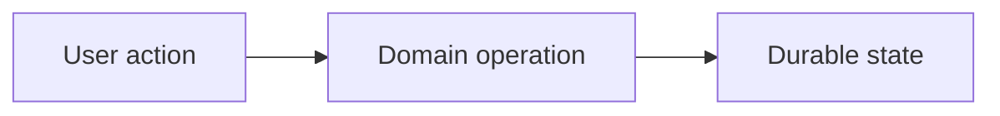

# Domain Name: Prototype-to-Core Handoff

## Executive Summary

Explain what the prototype implements, the user or business need, and the intended production direction in 3 to 6 bullets.

## Scope And Ownership

- **Owns:** Durable concepts and behavior owned by this domain.
- **Does not own:** Neighboring concerns that belong elsewhere.
- **Suggested core owner:** Existing or proposed `fc-core-srvc` module.
- **Primary prototype paths:** Links to relevant prototype code, SQL, and migrations.
- **Core files reviewed:** Links or paths to relevant core models, modules, and migrations.

## Intended Domain Model

Describe the clean, provider-neutral model the product should eventually have. Include a Mermaid relationship diagram only when it makes the model easier to review.

| Concept | Purpose | Key relationships | Tenant/location scope |
|---|---|---|---|
| Example | What it represents | What it belongs to or references | Tenant, location, global, or mixed |

## Current Prototype Implementation

Explain what exists today, where it is implemented, and which parts are mocked, simplified, or incomplete.

| Prototype artifact | Role | Important notes |
|---|---|---|
| `path/to/file` | Schema, service, API, or UI role | Current behavior or limitation |

## Core Mapping And Parity

| Prototype concept or behavior | Intended core concept/module | Current core status | Gap or next action |
|---|---|---|---|
| Example | Existing or proposed mapping | `aligned`, `partial`, `missing`, `core-ahead`, or `decision-needed` | Concrete action |

## Important Workflows

Document only workflows that affect domain ownership, durable state, integrations, or future backend implementation.

## Architecture Decisions

| Decision | Reason | Core impact |
|---|---|---|
| Example | Why this direction was chosen | None, future model change, new module, or decision needed |

## Deliberate Prototype Shortcuts

| Shortcut | Why it exists | Production replacement |
|---|---|---|
| Example | What allowed faster prototyping | How the core service should implement it |

## Open Decisions

List only unresolved questions that could materially change the model, ownership, or parity plan.

## Core Parity Checklist

- [ ] Core domain owner agreed
- [ ] Canonical entities and relationships agreed
- [ ] Tenant and location behavior agreed
- [ ] Integration mappings agreed
- [ ] Required core migrations identified
- [ ] Required services, APIs, or workflows identified
- [ ] Security, RLS, and permissions reviewed
- [ ] Tests and migration or backfill strategy identified
