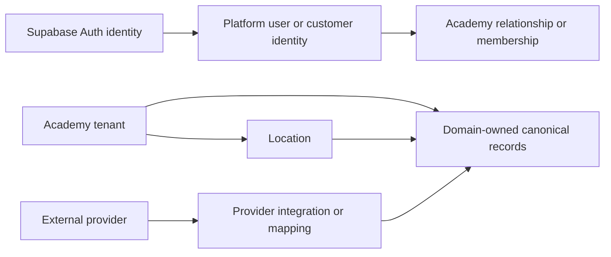

# Platform Foundations: Prototype-to-Core Handoff

## Executive Summary

- `bam-os-requirements` currently contains several fast-moving prototype and early production surfaces with separate Supabase-backed schemas and mixed data-access patterns.
- `fc-core-srvc` is the intended production backend direction: a multi-tenant modular monolith with provider-neutral canonical models and removable integration layers.
- New prototype data work should follow the core service's tenancy, identity, domain ownership, and provider-separation concepts without recreating its Python implementation.
- Existing prototype schemas are not automatically target architecture. Their intended concepts and parity gaps must be reviewed domain by domain.
- This handoff defines the cross-cutting rules used by all future domain handoffs.

## Scope And Ownership

- **Owns:** Cross-cutting tenancy, location scoping, identity boundaries, domain ownership, integration separation, persistence conventions, and parity documentation.
- **Does not own:** Sales, scheduling, marketing, content, training, support, billing, or other domain-specific rules.
- **Suggested core owner:** `core_tenancy` and shared platform infrastructure, with each business module owning its own durable entities.
- **Primary prototype paths:** `bam-ghl-agent/bam-portal/supabase/`, `bam-ghl-agent/bam-portal/src/services/`, `bam-ghl-agent/bam-portal/api/`, `fc-internal-content-engine/`, and `prototype/src/`.
- **Core files reviewed:** `docs/architecture.md`, `app/models/base.py`, `app/models/ownership.py`, `app/models/canonical/academy.py`, `app/models/canonical/location.py`, `app/models/canonical/user.py`, and `app/models/customer.py`.

## Intended Domain Model

| Concept | Purpose | Key relationships | Tenant/location scope |
|---|---|---|---|
| Academy | Primary business tenant | Owns locations and tenant-scoped domain records | Tenant root |
| Location | Physical or operating site | Belongs to an academy; scopes location-specific records | Academy-scoped |
| Auth identity | Authentication-provider identity | Maps to an application identity | Global |
| Platform user or customer identity | Represents a real application actor | May relate to academies through role or membership | Global or academy-related |
| Domain-owned canonical record | Permanent provider-neutral product data | Owned and written by one domain | Tenant and optionally location-scoped |
| Integration or mapping record | Provider tokens, IDs, raw payloads, and sync state | Maps provider records to canonical records | Tenant-scoped |
| Audit, event, or ledger record | Preserves history or enables idempotency | References the affected canonical record | Same scope as affected domain |

## Current Prototype Implementation

| Prototype artifact | Role | Important notes |
|---|---|---|
| `bam-ghl-agent/bam-portal/supabase/*.sql` | Feature schemas, migrations, and seeds | Schemas were created feature by feature and need domain-by-domain ownership and parity review |
| `bam-ghl-agent/bam-portal/src/services/` | Client-side data access helpers | Some domain access is organized into services, but direct Supabase access also exists elsewhere |
| `bam-ghl-agent/bam-portal/api/` | Serverless API and integration boundary | Holds some privileged operations and external integration workflows |
| `fc-internal-content-engine/content_engine_schema.sql` | Separate content-domain schema | Useful prototype, but its future core owner and canonical model are not yet agreed |
| `fc-internal-content-engine/src/services/` | Direct Supabase content and board access | Prototype-speed data access rather than a production module boundary |
| `prototype/src/` | Product and UX reference implementation | Primarily UI and product exploration; persistence decisions must be documented when introduced |

## Core Mapping And Parity

| Prototype concept or behavior | Intended core concept/module | Current core status | Gap or next action |
|---|---|---|---|
| Business or client account | `Academy` / `core_tenancy` | `partial` | Standardize when prototype `client` means an academy tenant versus an external agency client |
| Multi-location UI and data | `Location` / `core_tenancy` | `partial` | Require domain handoffs to identify which records are location-scoped |
| Supabase authentication | Supabase Auth mapped to application identities | `partial` | Map prototype staff, client users, members, parents, and students to distinct core identities |
| Feature-created tables | Domain-owned models in `app/models/ownership.py` | `missing` | Assign every durable prototype concept a proposed core owner |
| Direct Supabase reads and writes | Owning module public API and services | `partial` | Identify production service boundaries per domain without slowing prototype work |
| Provider IDs and tokens in feature flows | Integration source and mapping records | `partial` | Move permanent product meaning out of provider-specific records during parity work |
| Standalone SQL files and manual application | Alembic migrations | `partial` | Keep prototype SQL versioned now; define production migrations during parity implementation |
| Supabase RLS and serverless authorization | Core tenant context, service authorization, and database controls | `decision-needed` | Agree on the production enforcement boundary per surface |
| Audit tables and external event handling | Audit records, ledgers, and idempotent webhook events | `partial` | Identify history and idempotency requirements in each domain handoff |

## Architecture Decisions

| Decision | Reason | Core impact |
|---|---|---|
| Treat `fc-core-srvc` as architectural direction, not compatibility constraint | The prototype is intentionally ahead and exploratory | Core can adopt clean concepts without preserving prototype implementation details |
| Keep prototype implementation in its current stack | Recreating FastAPI and SQLAlchemy patterns would slow product learning without improving the prototype | Domain handoffs describe intended production boundaries instead |
| Require one owner for every durable concept | Shared writes and unclear ownership make future extraction and parity work expensive | Each new concept must map to an existing or proposed core module |
| Maintain domain handoffs in the prototype repository | The prototype team knows the intent and changes first | Core developers receive reviewable intent, mappings, gaps, and next actions |

## Deliberate Prototype Shortcuts

| Shortcut | Why it exists | Production replacement |
|---|---|---|
| Direct Supabase access from UI or feature services | Fast iteration and simple deployment | Owning core module service or API boundary |
| Independent feature SQL files | Features have evolved at different speeds | Ordered, tested Alembic migrations |
| Mixed provider-specific and product data | Early integrations often define the first working shape | Provider-neutral canonical records plus integration mappings |
| Inconsistent domain boundaries across subprojects | Multiple prototypes were built independently | Agreed module ownership and public APIs |

## Open Decisions

- When should the prototype term `client` map to a core `Academy`, and when does it represent a different agency/customer relationship?
- Which current prototype schemas are durable product domains versus temporary operational tools?
- Which production authorization rules belong in the core service, PostgreSQL policies, or both?
- Which new core modules will own marketing, content, training, support, and other prototype-ahead concepts?
- What migration or backfill strategy should be used when each prototype domain reaches parity work?

## Core Parity Checklist

- [x] Cross-cutting core architecture direction reviewed
- [ ] Canonical identity mapping agreed
- [ ] Tenant and location terminology agreed
- [ ] Every existing durable prototype table assigned a proposed domain owner
- [ ] Integration mapping rules applied consistently
- [ ] Production authorization and RLS strategy agreed
- [ ] Domain-by-domain parity work identified and prioritized
